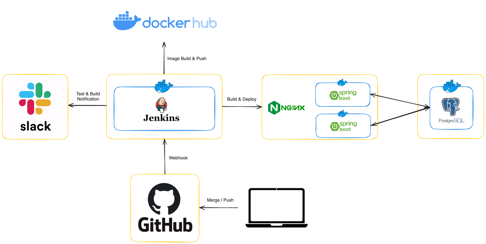
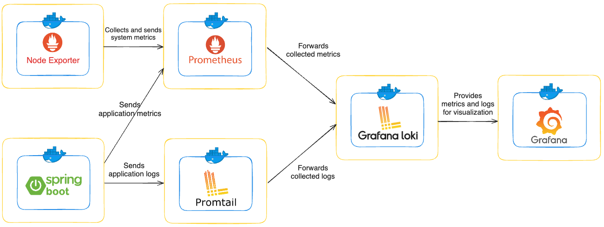
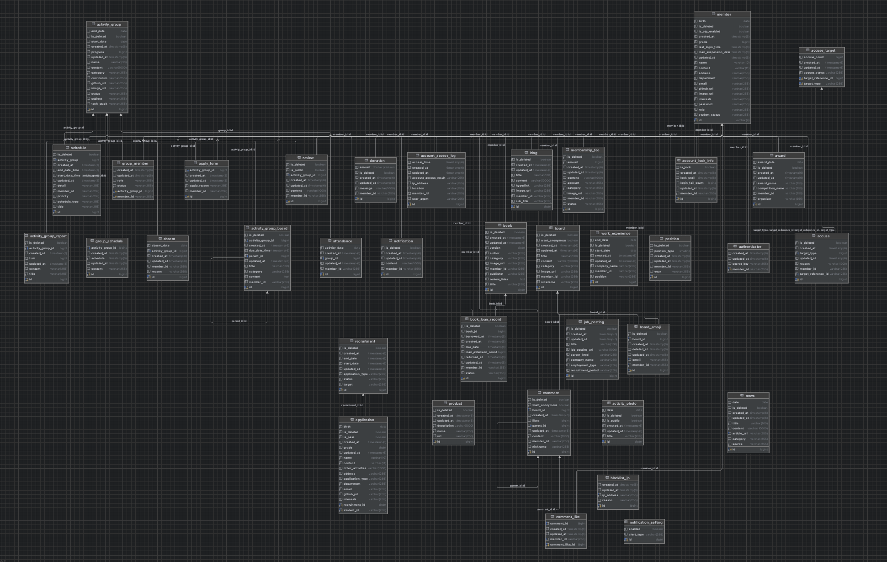

# C-Lab Server
[](https://www.gnu.org/licenses/gpl-3.0)
[](https://github.com/KGU-C-Lab/clab-server/actions/workflows/spring-boot-gradle-ci.yml)

- [한국어](README.md)
- [English](README_EN.md)

## 프로젝트 개요
C-Lab Server 프로젝트는 경기대학교 개발보안 동아리 C-Lab을 위한 플랫폼으로 시작되었습니다. 그러나 현재는 이를 넘어, 유사한 플랫폼을 만들고자 하는 사람들에게 유용한 참고 자료가 되는 것을 목표로 하고 있습니다. 이러한 이유로, 우리는 모든 코드와 다양한 서버 관련 설정을 공개하고 있으며, 다양한 노력과 실험을 통해 코드 품질을 지속적으로 향상시키고자 합니다.

또한, 우리는 사용자가 신뢰할 수 있는 안전한 플랫폼을 만들기 위해 노력하고 있습니다. 이를 위해 한국인터넷진흥원(KISA)이 제공하는 '[소프트웨어 개발 보안 가이드](https://www.kisa.or.kr/2060204/form?postSeq=5&lang_type=KO&page=1)'를 준수하고자 합니다. 우리는 항상 피드백을 받을 준비가 되어 있으며, 다양한 의견과 제안을 적극적으로 반영하려고 노력합니다.

백엔드 시스템뿐만 아니라 프론트엔드 시스템도 모두 공개되어 있습니다. 관심이 있으신 분들은 [여기](https://github.com/KGU-C-Lab/clab.page)에서 프론트엔드 리포지토리도 확인해보세요.

현재 서비스되고 있는 페이지는 [여기](https://www.clab.page/)에서 확인할 수 있습니다.

## 프로젝트 목적 및 기능
C-Lab Server 프로젝트는 동아리 활동을 지원하고 회원 간의 원활한 소통을 촉진하기 위해 통합 서비스를 제공합니다.

- **회원 관리**: 멤버스 페이지를 통해 동아리 운영에 필요한 핵심 기능을 제공하며, 학습 관리 시스템, 도서 대출, 재정 관리 등을 포함합니다.
- **협업 및 참여**: 개인 및 그룹 일정 관리, 개인 클라우드 저장 공간, 커뮤니티 기능, 채용 공고 및 실적 취합 기능 등을 통해 회원들의 참여와 협력을 증진합니다.
- **효율성과 편의성**: 사용자 편의성과 동아리 운영의 효율성을 높이는 다양한 기능을 하나의 플랫폼에서 제공하여 동아리의 일상적인 관리를 간소화합니다.

## 요구 사항
- [Docker](https://docs.docker.com/engine/install/) 및 [Docker Compose](https://docs.docker.com/compose/install/) 설치
- Linux 기반 OS 권장
- Windows의 경우 [WSL2](https://learn.microsoft.com/en-us/windows/wsl/install) 사용

## 시작하기
### 리포지토리 클론
로컬 시스템에 리포지토리를 클론합니다.
```bash
git clone https://github.com/KGU-C-Lab/clab-server.git
cd clab-server
```

### Docker Compose 설정
Docker Compose 파일은 `infra` 디렉토리에 있습니다. 다음 단계에 따라 컨테이너를 설정하고 실행합니다.

### 참고 사항
- 컨테이너 데이터를 유지하려면 필요한 디렉토리를 생성하고 권한을 설정하세요.

```bash
# 데이터를 유지하려는 경우에만 실행
sudo mkdir -p /infra/nginx /infra/jenkins /infra/redis/data /infra/postgresql/data
sudo chown -R $(whoami):$(whoami) /infra
```

- 환경 변수를 설정하세요 (.env 파일을 이용할 수도 있습니다).

```bash
# 환경 변수 설정
export REDIS_PASSWORD=your_redis_password
export POSTGRES_USER=your_postgres_username
export POSTGRES_PASSWORD=your_postgres_password
```

### Docker Compose 실행
Docker Compose를 실행하여 컨테이너를 시작합니다.

```bash
cd infra
docker-compose up -d # 또는 'docker compose up -d'
```

### Spring Boot 애플리케이션 구성
컨테이너를 시작한 후, `src/main/resources/application.yml` 파일을 구성합니다. `${}` 자리 표시자를 실제 값으로 변경합니다.

### 애플리케이션 실행
모든 구성이 완료되면 Spring Boot 애플리케이션을 실행합니다.

```bash
./gradlew bootRun
```

### Additional Information
- Docker 및 Docker Compose 설치: [Get Docker](https://docs.docker.com/get-docker/)
- WSL2 설치 및 설정: [Install WSL2](https://learn.microsoft.com/en-us/windows/wsl/install)
- Spring Boot 공식 문서: [Spring Boot Docs](https://spring.io/projects/spring-boot)

## Project Structure
```markdown
api/
├── category/
│   ├── domain/
│   │   ├── adapter/
│   │   │   ├── in/
│   │   │   │   ├── web/
│   │   │   └── out/
│   │   │       ├── persistence/
│   │   ├── application/
│   │   │   ├── dto/
│   │   │   ├── event/
│   │   │   ├── port/
│   │   │   │   ├── in/
│   │   │   │   └── out/
│   │   │   ├── service/
│   │   └── domain/
└── external/
│   ├── category/
│   │   ├── domain/
│   │   │   ├── application/
│   │   │   │   ├── port/
│   │   │   │   └── service/
└── global/
│   ├── auth/
│   ├── common/
│   ├── config/
│   ├── exception/
│   ├── handler/
│   ├── util/
```

### 아키텍처
이 프로젝트는 포트 앤 어댑터([헥사고날](https://en.wikipedia.org/wiki/Hexagonal_architecture_(software))) 아키텍처 패턴에 따라 구조화되어 있습니다. 이 아키텍처는 명확한 관심사 분리를 통해 코드베이스를 모듈화하고, 테스트 가능하며, 유지보수가 용이하도록 합니다.

### 패키지 구성
이 프로젝트의 패키지는 package-private 관례를 사용하여 구성되어 있습니다. 이를 통해 구현 세부 사항을 캡슐화하고, 필요한 구성 요소만 노출하여 모듈성과 유지보수성을 향상시킬 수 있습니다.

### `domain`
- **adapter**: 외부 시스템과의 상호작용을 담당하는 어댑터들이 위치합니다. 여기에는 웹 인터페이스를 처리하는 `in` 어댑터와 데이터베이스와의 상호작용을 처리하는 `out` 어댑터가 포함됩니다.
    - **in**: 외부에서 들어오는 요청을 처리합니다. 예를 들어, HTTP 요청을 처리하는 컨트롤러가 포함됩니다.
    - **out**: 외부 시스템과의 상호작용을 처리합니다. 예를 들어, 데이터베이스와의 연동을 처리하는 어댑터가 포함됩니다.
- **application**: 도메인 로직을 처리하는 서비스와 포트가 위치합니다. DTO(Data Transfer Object)와 이벤트도 이 계층에 포함됩니다.
    - **dto**: 요청과 응답을 처리하는 DTO 클래스들이 위치합니다. DTO는 데이터 전송을 위한 객체로, 계층 간 데이터 교환을 담당합니다.
    - **event**: 도메인 이벤트와 관련된 클래스들이 위치합니다. 도메인 이벤트는 비즈니스 로직에서 발생하는 중요한 사건을 나타냅니다.
    - **port**: 인바운드 및 아웃바운드 포트 인터페이스를 정의합니다.
        - **in**: 애플리케이션 외부에서 들어오는 요청을 처리하는 인터페이스입니다.
        - **out**: 외부 시스템이나 데이터베이스로의 요청을 처리하는 인터페이스입니다.
    - **service**: 인바운드 포트 인터페이스를 구현하는 서비스 클래스들이 위치합니다. 서비스 클래스는 비즈니스 로직을 구현하고, 필요한 경우 아웃바운드 포트를 호출합니다.
- **domain**: 애플리케이션의 핵심 비즈니스 로직과 규칙을 정의하는 도메인 모델이 위치합니다. 도메인 모델은 엔티티(Entity), 밸류 객체(Value Object), 애그리게잇(Aggregate) 등을 포함합니다.

### `external`
- **category**: 특정 도메인과 관련된 클래스들이 위치합니다. 외부 시스템과 상호작용하는 로직이 포함됩니다.
    - **domain**: 각 도메인에 대한 비즈니스 로직과 규칙을 정의합니다.
    - **application**: 도메인에 대한 애플리케이션 로직을 처리합니다.
        - **port**: 도메인 외부에서 들어오는 요청을 처리하는 인바운드 포트와, 도메인 내부에서 외부 시스템으로의 요청을 처리하는 아웃바운드 포트를 정의합니다.
        - **service**: 인바운드 포트 인터페이스를 구현하는 서비스 클래스들이 위치합니다.

### `global`
- **auth**: 인증 관련 기능을 처리하는 클래스가 포함됩니다.
- **common**: 여러 도메인에서 공통적으로 사용되는 유틸리티 클래스가 포함됩니다.
- **config**: 프로젝트의 설정 관련 클래스가 포함됩니다.
- **exception**: 전역적인 예외 처리 로직을 담당하는 클래스가 포함됩니다.
- **handler**: 예외 및 특정 상황에 대한 핸들러를 정의하는 클래스가 포함됩니다.
- **util**: 일반적인 유틸리티 기능을 제공하는 클래스가 포함됩니다.

## 시스템 아키텍처 다이어그램


## 모니터링 서비스 다이어그램


## Entity-Relationship 다이어그램
> **참고**: 실제 데이터베이스 설계는 외래키를 사용하지 않지만, 시각적으로 표현하기 위해 다이어그램에서는 외래키 연결이 표시됩니다.



## 라이선스
이 프로젝트는 GNU 일반 공중 사용 허가서(GPL) v3.0에 따라 라이선스가 부여됩니다. 자세한 내용은 [LICENSE](https://github.com/KGU-C-Lab/clab-server?tab=GPL-3.0-1-ov-file#readme) 파일을 확인하세요.

## 기여자
<a href="https://github.com/KGU-C-Lab/clab-server/graphs/contributors">
  
</a>

## 기여하기
이 프로젝트에 기여하려면 다음 단계를 따라주세요.
[CONTRIBUTING.md](CONTRIBUTING.md)
